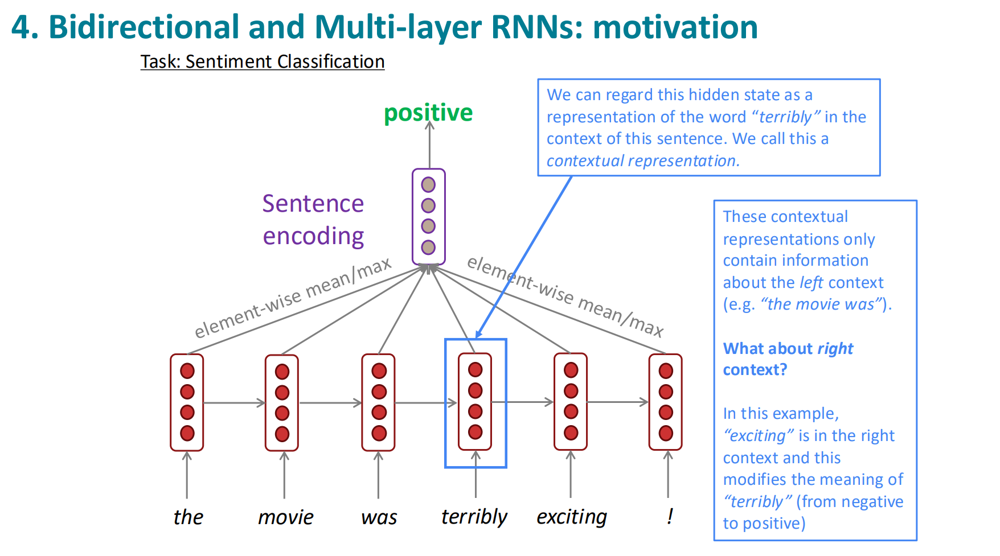
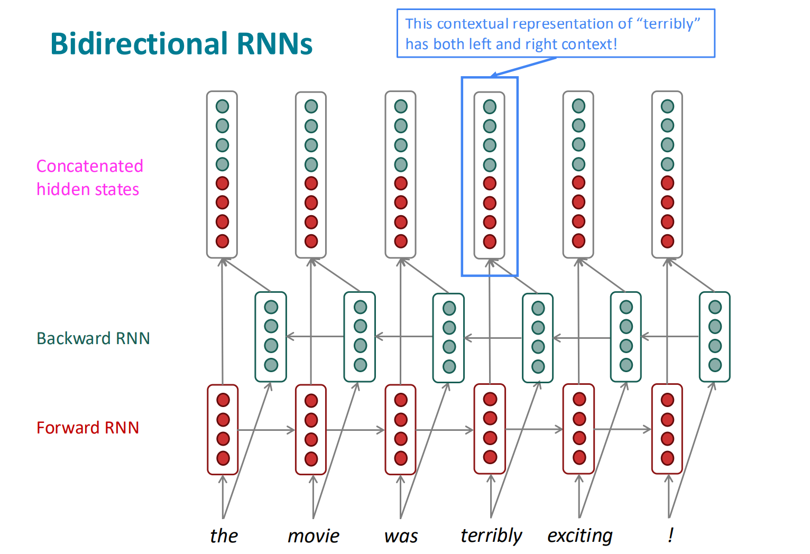
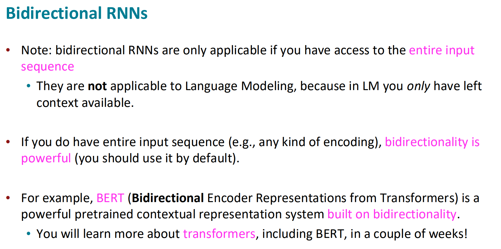
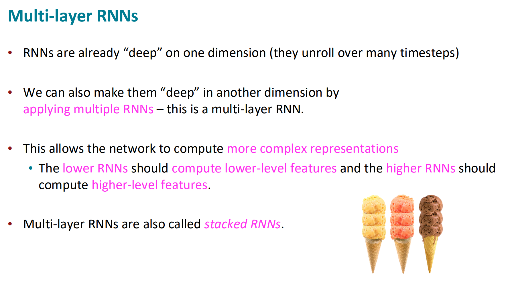
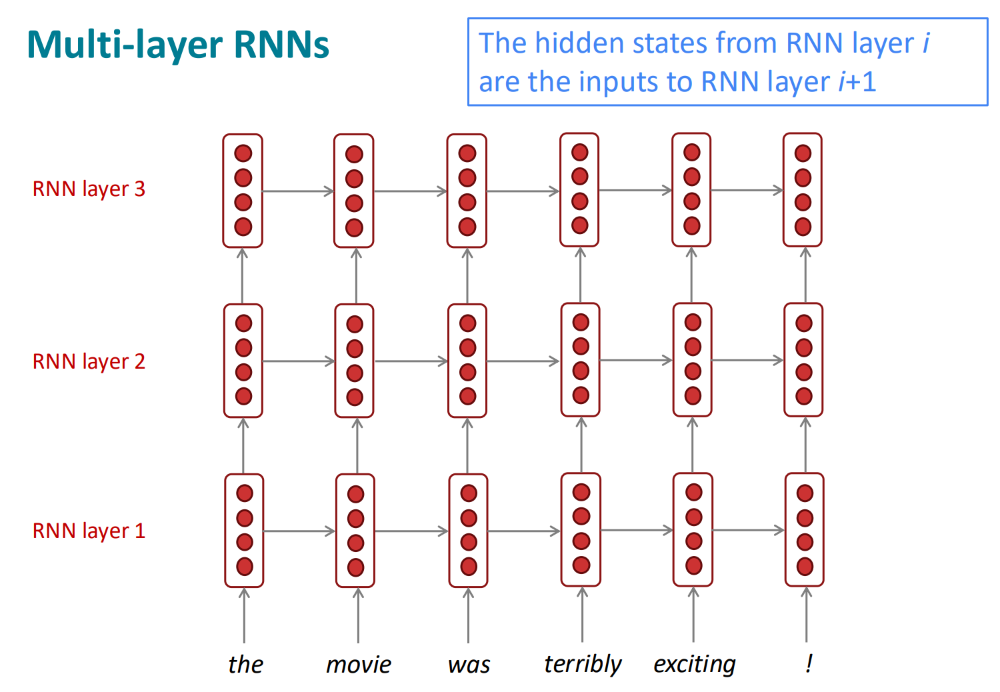

https://web.stanford.edu/class/cs224n/slides_w25/cs224n-2025-lecture06-fancy-rnn.pdf

Bidirectionality is not suitable for Language Modelling as you don't have the end of the context - you are trying to predict it. But otherwise it should be used in most cases.

03251