https://web.stanford.edu/class/cs224n/slides_w25/cs224n-2025-lecture10-instruction-tunining-rlhf.pdf

Pretrained LM just tries to continue your prompt as if it was a single text. It is not made to assist. You can finetune to your specific task with small number of data. But finetuning can be done on large Q&A datasets to train generic assistants. Data was human-made. 

There are 2 problems with this:
- tasks like open-ended creative generation have no right answer
- language modeling penalizes all token-level mistakes equally, but some errors are worse than others

To optimize results to human preferences we ask users to do pairwise comparisons of 2 (or more) responses. To cut the cost of human-in-the-loop we train a separate model to model the preferences of a human.

So we got InstructGPT & ChatGPT.

Human preferences are unreliable (human can prefer a response that sounds more reliable but actually provides incorrect information). Chatbots are rewarded to produce responses that seem authoritative and helpful, regardless of truth. This can result in making up facts + hallucinations.
Model of human preferences is even worse.

So we just simplify everything, remove RL and do Direct Preference Optimization (DPO).
DPO directly optimizes the model to generate responses that align with preferred human choices. It does this by maximizing the probability of preferred responses while minimizing the probability of dispreferred ones.

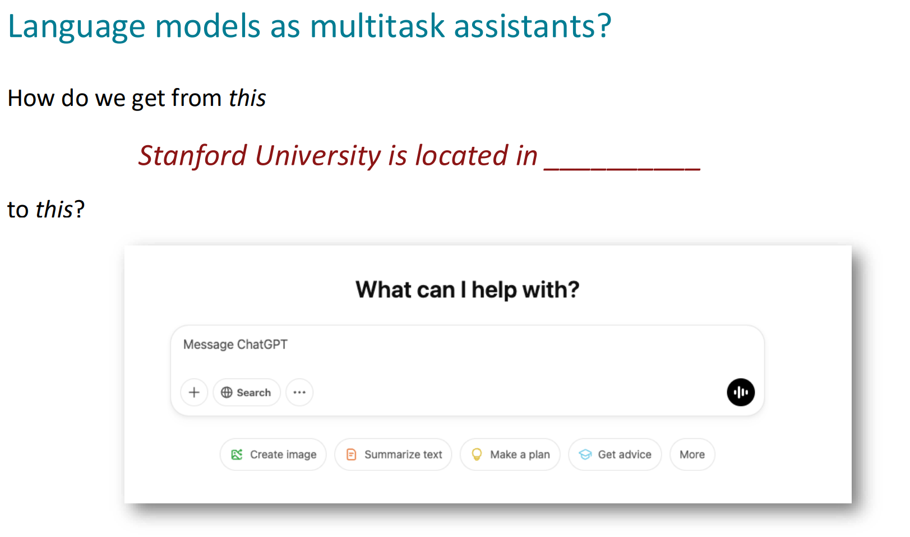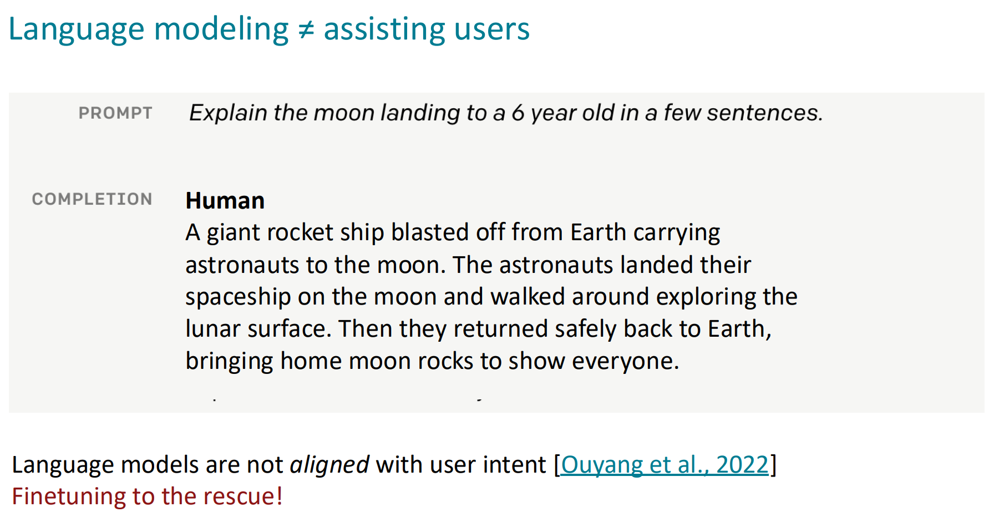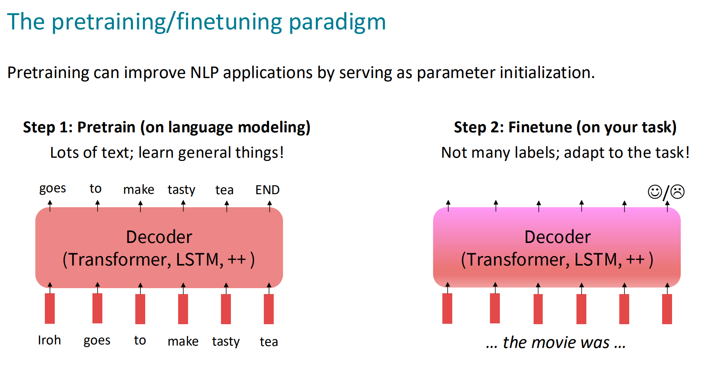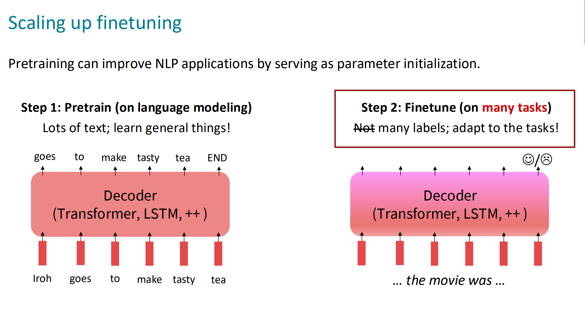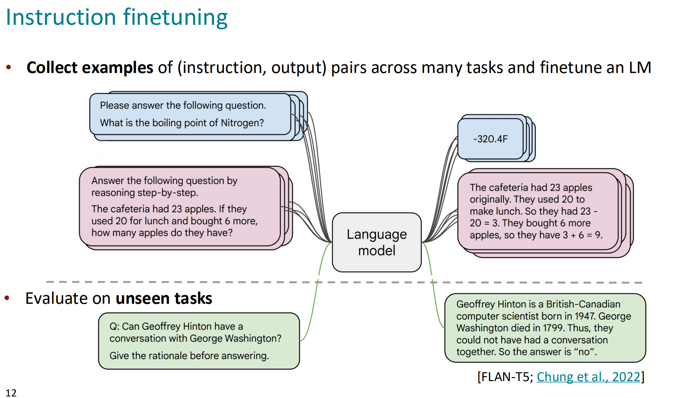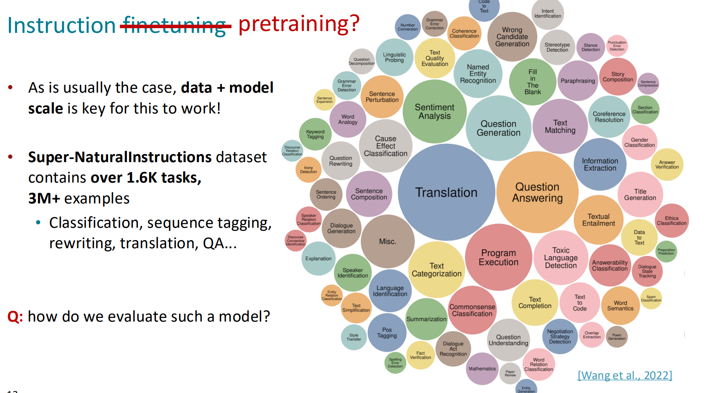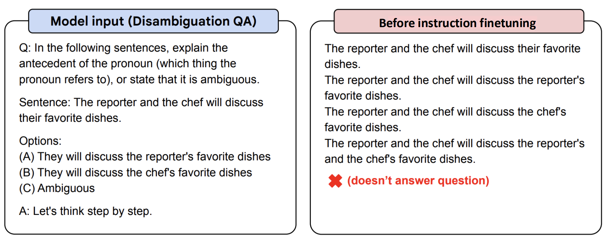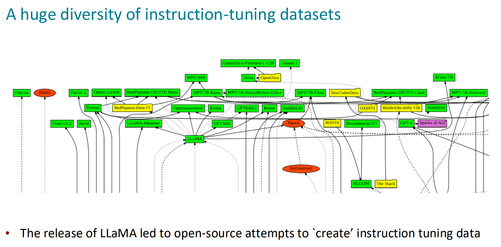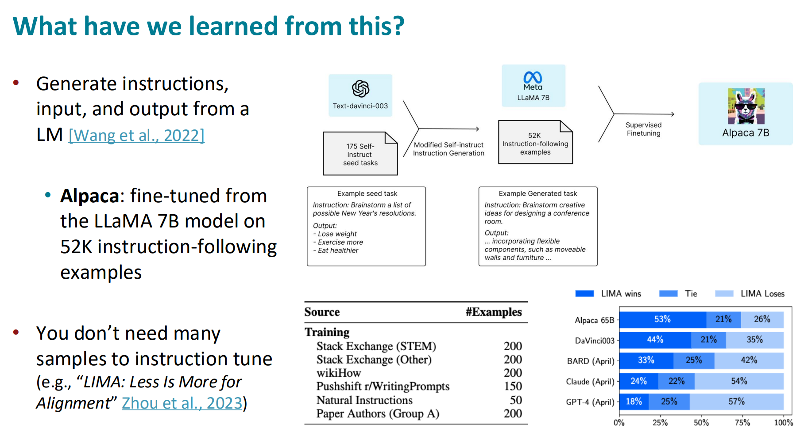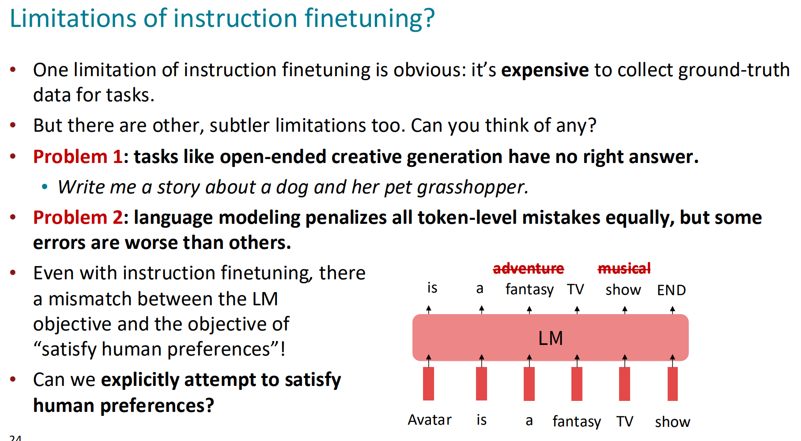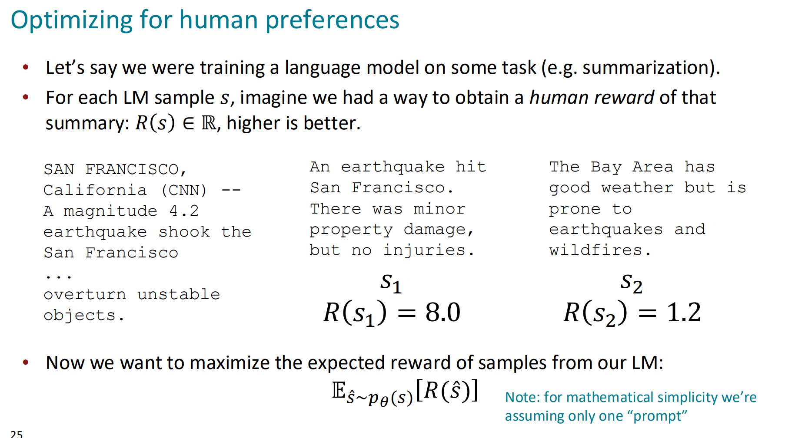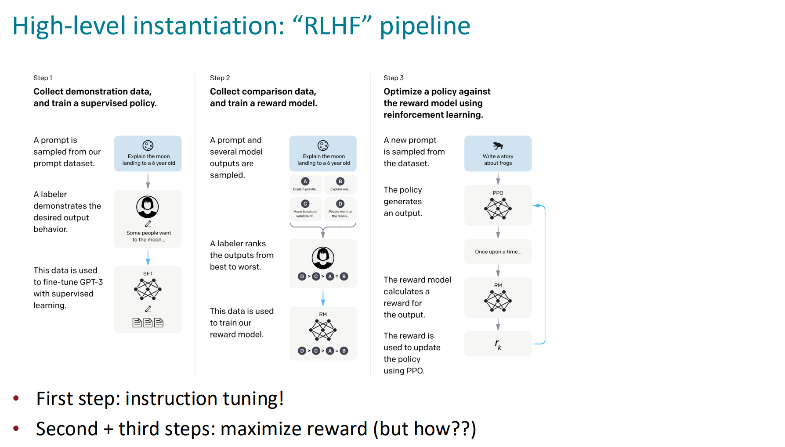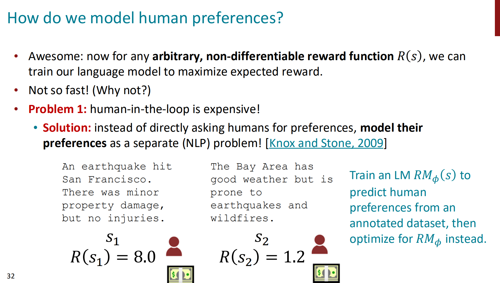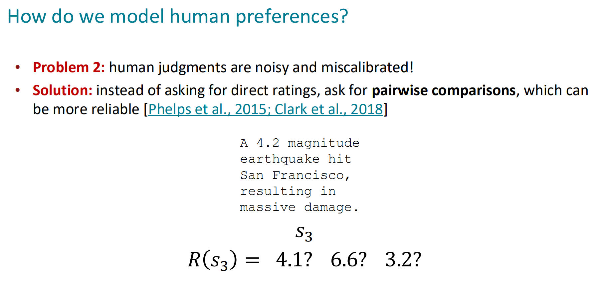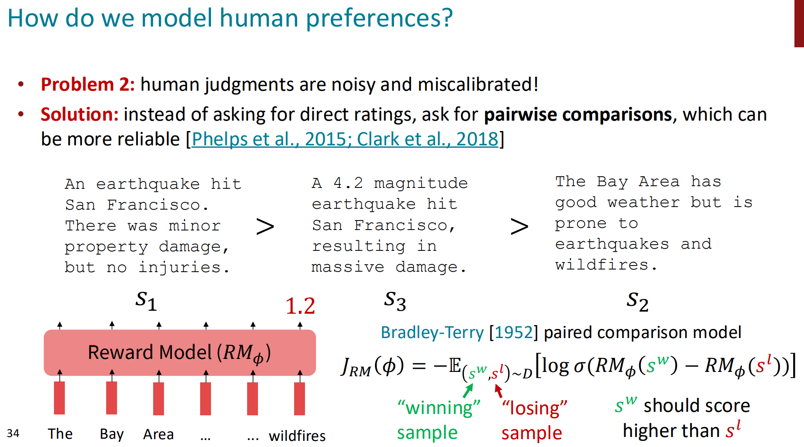03311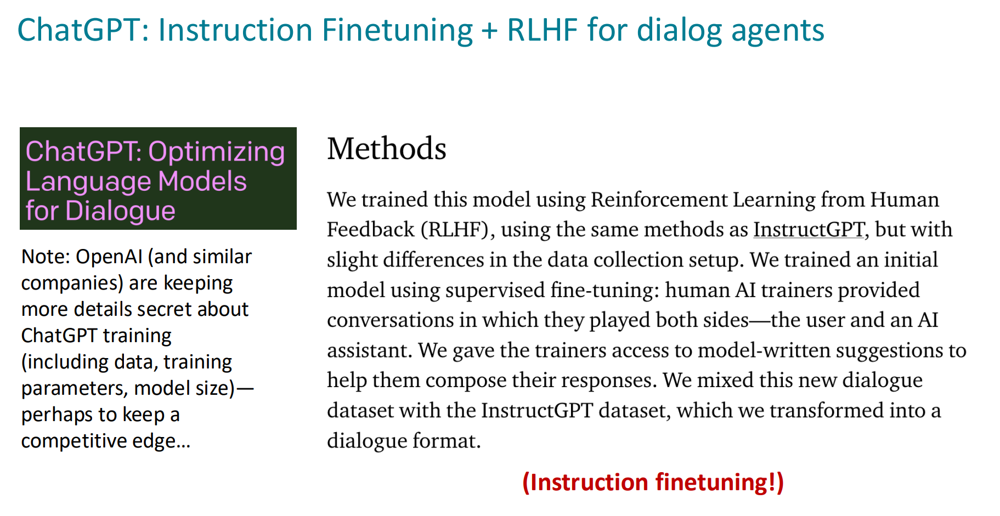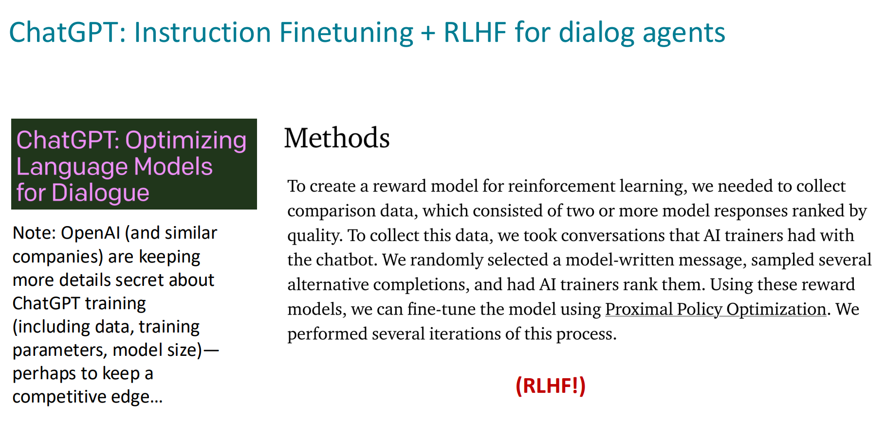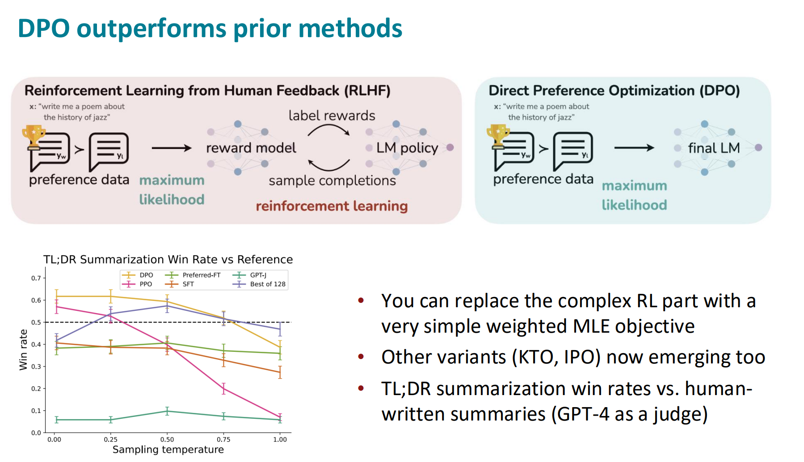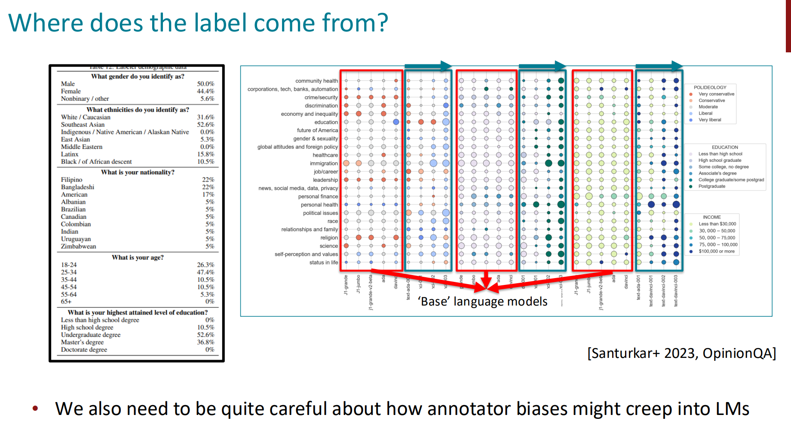