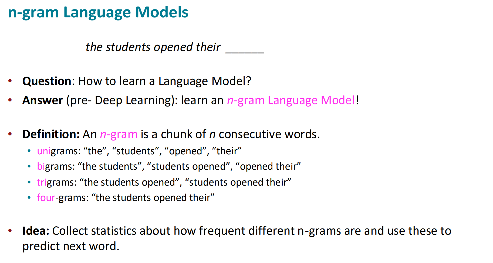
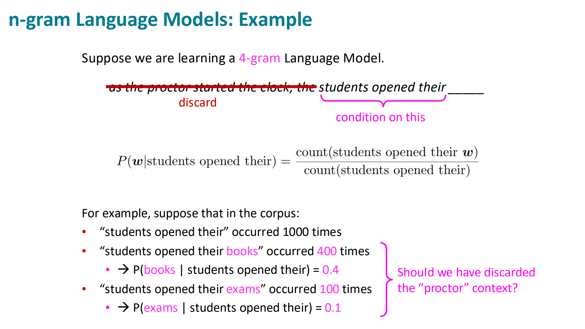
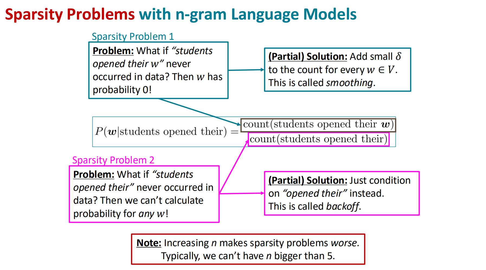
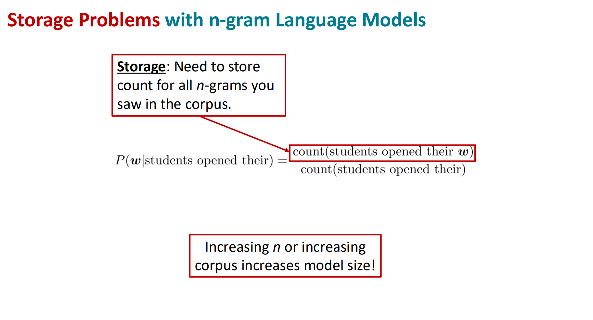
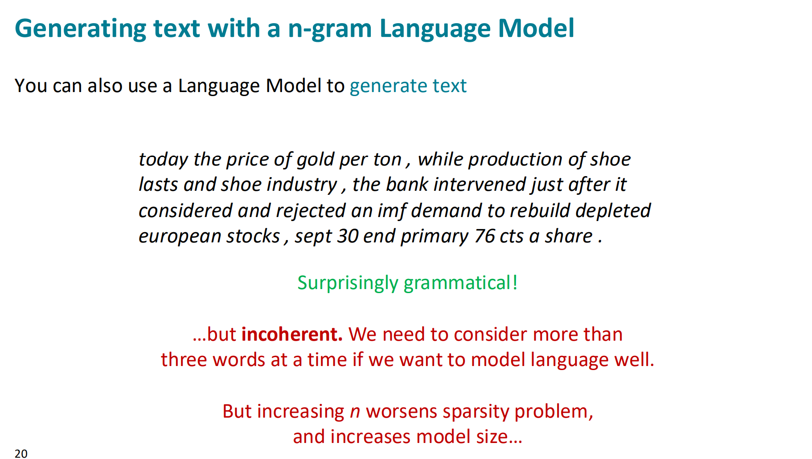
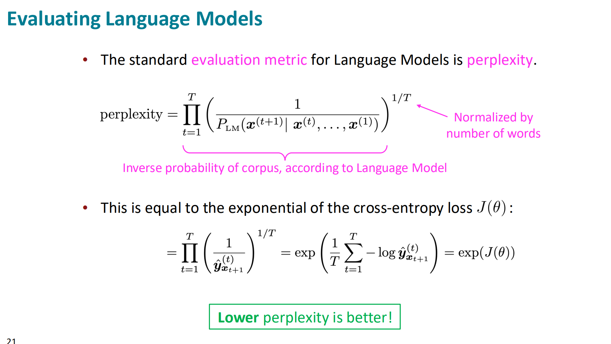

https://web.stanford.edu/class/cs224n/slides_w25/cs224n-2025-lecture05-rnnlm.pdf

The main idea is to pick n words standing together and look for what statistically is the next word. If you have low n (like 3) it doesn't have enough context. If you have larger n (like 7) it's much more possible that this combination of words never occured.
1